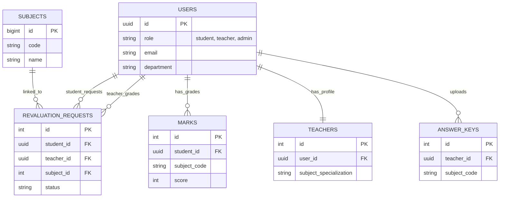

# Database Schema Documentation

This document provides a comprehensive reference for the PostgreSQL database schema used in the **ReValuate** system. It is intended for contributors to understand the data structure and relationships.

##  Schema Overview

The database is built on **PostgreSQL** and uses UUIDs for user identification to ensure scalability and security.

### Entity-Relationship Diagram (ERD)

## Table Definitions

### 1. `users`
Stores all registered users (Students, Teachers, Admin).

| Column Name | Data Type | Description |
| :--- | :--- | :--- |
| `id` | `uuid` | Primary Key. Unique user identifier. |
| `full_name` | `varchar` | Users full name. |
| `email` | `varchar` | Unique email address. |
| `password_hash` | `varchar` | Encrypted password string (Argon2/Bcrypt). |
| `role` | `varchar` | Role: `student`, `teacher`, `admin`. |
| `department` | `varchar` | Dept code (e.g., `CSE`, `ECE`). |
| `reg_no` | `varchar` | Registration number (Students only). |
| `subject_specialization`| `varchar` | Subject specialization (Teachers only). |
| `avatar_url` | `text` | URL to profile picture. |
| `created_at` | `timestamp` | Account creation time. |
| `updated_at` | `timestamptz` | Last update time. |

### 2. `subjects`
List of all subjects available for exams and revaluation.

| Column Name | Data Type | Nullable | Description |
| :--- | :--- | :--- | :--- |
| `id` | `bigint` | No | Primary Key. |
| `code` | `text` | Yes | Subject Code (e.g., `CS101`). |
| `name` | `text` | Yes | Subject Name. |
| `department` | `text` | Yes | Department offering the subject. |
| `created_at` | `timestamptz` | Yes | Record creation time. |

### 3. `revaluation_requests`
The core table managing the lifecycle of a revaluation request.

| Column Name | Data Type | Nullable | Description |
| :--- | :--- | :--- | :--- |
| `id` | `int4` | No | Primary Key. |
| `application_code` | `varchar` | Yes | Unique code for tracking the request. |
| `student_id` | `uuid` | Yes | FK referencing `users(id)`. |
| `teacher_id` | `uuid` | Yes | FK referencing `users(id)` (assigned grader). |
| `subject_id` | `int4` | Yes | FK referencing `subjects(id)` (optional link). |
| `subject_code` | `varchar` | Yes | Code of the subject being revaluated. |
| `status` | `request_status`| Yes | Enum: `pending`, `processing`, `completed`, etc. |
| `file_urls` | `ARRAY _text` | Yes | Array of URLs for uploaded answer script images/PDFs. |
| `answer_script_urls` | `ARRAY _text` | Yes | (Legacy/Alt) Array of URLs for scripts. |
| `ocr_data` | `text` | Yes | Extracted text from the uploaded scripts. |
| `ai_feedback` | `jsonb` | Yes | JSON object containing AI analysis and grading status. |
| `teacher_notes` | `text` | Yes | Remarks added by the human evaluator. |
| `payment_status` | `varchar` | Yes | `paid`, `unpaid`. |
| `payment_transaction_reference` | `varchar` | Yes | Transaction ID (Generic reference). |
| `amount_paid` | `numeric` | Yes | Amount paid for revaluation. |
| `created_at` | `timestamp` | Yes | Request submission time. |
| `updated_at` | `timestamp` | Yes | Last status update. |

### 4. `marks`
Stores exam scores. This table is likely used to fetch original marks before revaluation.

| Column Name | Data Type | Nullable | Description |
| :--- | :--- | :--- | :--- |
| `id` | `int4` | No | Primary Key. |
| `student_id` | `uuid` | Yes | FK referencing `users(id)`. |
| `reg_no` | `varchar` | Yes | Student Registration Number. |
| `subject_name` | `varchar` | Yes | Name of the subject. |
| `subject_code` | `varchar` | Yes | Code of the subject. |
| `score` | `int4` | Yes | Marks obtained. |
| `total_score` | `int4` | Yes | Max marks (default 100). |
| `percentage` | `numeric` | Yes | `(score/total_score) * 100`. |
| `grade` | `varchar` | Yes | Letter grade (e.g., A, B, F). |
| `status` | `varchar` | Yes | Pass/Fail status. |
| `created_at` | `timestamp` | Yes | Record creation time. |

### 5. `answer_keys`
Stores reference materials (answer keys) uploaded by teachers for AI comparison.

| Column Name | Data Type | Nullable | Description |
| :--- | :--- | :--- | :--- |
| `id` | `int4` | No | Primary Key. |
| `teacher_id` | `uuid` | Yes | FK referencing `users(id)`. |
| `subject_code` | `varchar` | Yes | Subject code this key belongs to. |
| `file_url` | `text` | Yes | URL of the uploaded answer key document. |
| `extracted_text` | `text` | Yes | Text extracted from the key via OCR. |
| `embeddings_path` | `text` | Yes | Path to vector embeddings for RAG/Similarity search. |
| `status` | `varchar` | Yes | Processing status (e.g., `embedded`, `failed`). |
| `error_message` | `text` | Yes | Error details if processing failed. |
| `created_at` | `timestamp` | Yes | Upload time. |
| `updated_at` | `timestamp` | Yes | Last update time. |

### 6. `teachers`
A supplementary table to store specific details for teacher accounts.

| Column Name | Data Type | Nullable | Description |
| :--- | :--- | :--- | :--- |
| `id` | `int4` | No | Primary Key. |
| `user_id` | `uuid` | Yes | FK referencing `users(id)`. |
| `subject_specialization`| `text` | Yes | Comma-separated or descriptive specialization. |
| `is_active` | `bool` | Yes | Teacher availability status. |
| `created_at` | `timestamptz` | Yes | Record creation time. |
